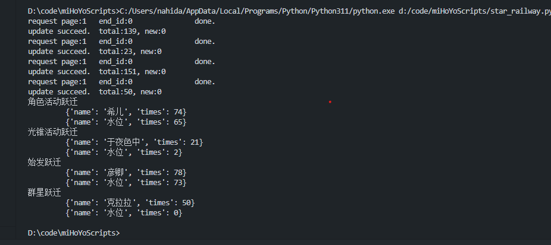

# 简陋版抽卡记录导出

## 原神

### tbd

## 星穹铁道

### 环境准备

1. python3，最新版就可以
2. adb，查log链接用

### usage

1. 手机打开*开发者模式-USB调试*
2. 电脑打开cmd输入*adb devices*,确认设备连接
   > 
3. 输入 *adb logcat > star_railway.log*
4. 打开*star_railway.log*，搜索*gacha_webview*,找到gacha log的链接
   > 
5. 打开链接，按下*Ctrl+Shift+I*打开web控制台，切换到*网络*选项卡
   > 
6. 网页处切换到*历史记录*选项卡
   > 
7. 右键红框处链接，选择*复制-复制链接地址*，放到项目目录下*UserData\star_railway_gacha.txt*
8. 运行*star_railway.py*
   > 

### tips

1. 原理包括api其实跟原神都是一样的，但是之前写代码的太拉了，所以重写了一遍
2. 获取链接核心是里面的auth_key，原神那边别人写的工具好像有更简洁的办法来获取，但是我不会（
3. 第一次弄可能稍微繁琐，但是其实没啥技术含量，多来几次就熟悉了
